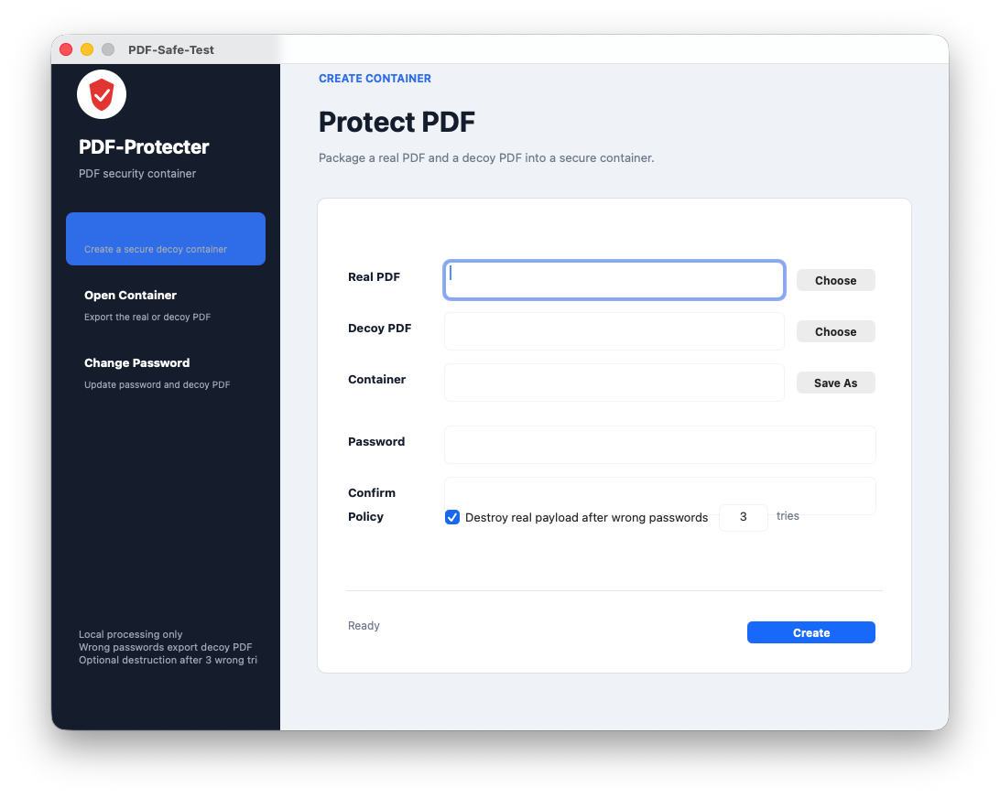

# PDF-Protecter

PDF-Protecter is a local PDF security container app. It packages a real PDF and a decoy PDF into a `.safe` file, then uses a password to decide which PDF is exported.

When the correct password is entered, the app exports the real PDF. When an incorrect password is entered, the app exports the decoy PDF. You can also set a wrong-password limit, after which the real encrypted payload inside the container is destroyed.

`.safe` files are not standard PDF files. They cannot be opened directly with macOS Preview or other PDF readers. Open them with PDF-Protecter first, then export a normal `.pdf` file.

## Screenshot

## Features

- Create `.safe` security containers
- Add a real PDF and a decoy PDF
- Export the real PDF with the correct password
- Export the decoy PDF with an incorrect password
- Optionally destroy the real payload after repeated wrong passwords
- Change the container password
- Process files locally without uploading them
- Follow the system language for Chinese or English UI

## How To Use

### 1. Protect A PDF

Open the app and select `Protect PDF`.

1. Choose the real PDF you want to protect.
2. Choose the decoy PDF.
3. Choose where to save the `.safe` container.
4. Enter and confirm the access password.
5. Enable the wrong-password destruction policy if needed.
6. Click `Create`.

After creation, you will get a `.safe` file. This file should be opened with PDF-Protecter.

### 2. Open A Container

Select `Open Container`.

1. Choose an existing `.safe` file.
2. Choose where to export the PDF.
3. Enter the access password.
4. Click `Export PDF`.

The correct password exports the real PDF. An incorrect password exports the decoy PDF.

### 3. Change Password

Select `Change Password`.

1. Choose the `.safe` file you want to update.
2. Optionally choose a new decoy PDF.
3. Choose where to save the updated container.
4. Enter the current password.
5. Enter and confirm the new password.
6. Click `Update`.

The app will create a new `.safe` container with the updated password.

## Notes

- `.safe` files must be opened with PDF-Protecter.
- Exported `.pdf` files are normal PDF files and can be opened with system PDF readers.
- The destruction policy only removes the real encrypted payload inside the `.safe` container. It does not delete the original real PDF elsewhere on your computer.
- If a `.safe` file is copied before opening, the copied file keeps the wrong-password state from the time it was copied.
